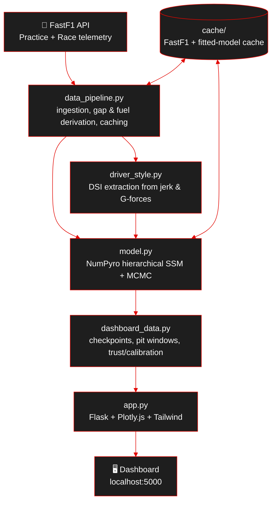
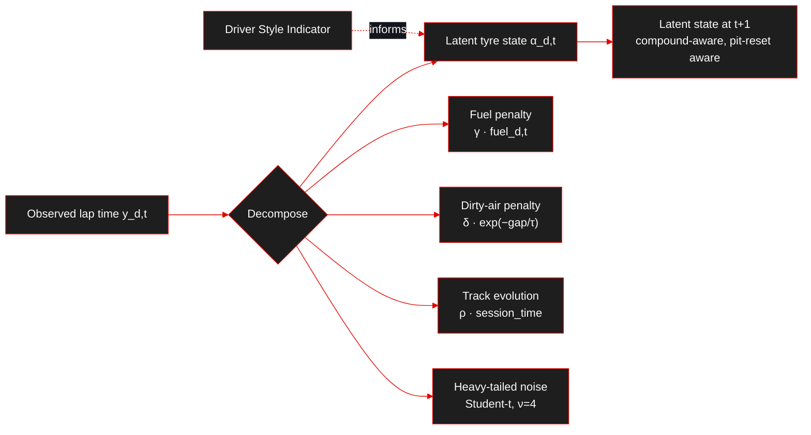
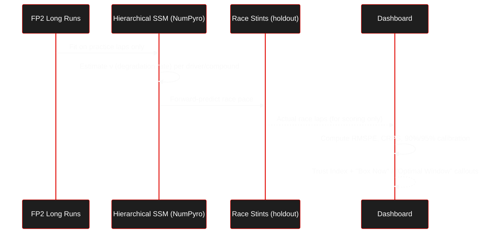

<p align="center">
  
  
  
  
</p>

<p align="center">
  
  
  
</p>

---

# 🏎️ Tyre Degradation Intelligence

**Isolating true tyre wear rates in Formula 1 — separated from fuel load, dirty air, and track evolution.**

> A competition-aligned Bayesian hierarchical state-space modeling framework, paired with an interactive dashboard, that predicts actual race-day tyre pace from **practice session data alone** — with full uncertainty quantification.

Built on and extending: **"A State-Space Approach to Modeling Tire Degradation in Formula 1 Racing"** — Cole Cappello & Andrew Hoegh (arXiv:2512.00640v1).

---

## 📑 Table of Contents

- [Overview](#-overview)
- [Key Features](#-key-features)
- [Architecture & Workflow Diagrams](#-architecture--workflow-diagrams)
- [Mathematical Formulation](#-mathematical-formulation)
- [Tech Stack](#-tech-stack)
- [Project Structure](#-project-structure)
- [Getting Started](#-getting-started)
- [Using the Dashboard](#-using-the-dashboard)
- [Benchmark Results](#-benchmark-results)
- [Evaluation Criteria Compliance](#-evaluation-criteria-compliance)
- [Assumptions & Limitations](#-assumptions--limitations)
- [Troubleshooting](#-troubleshooting)
- [Roadmap](#-roadmap)
- [Contributing](#-contributing)
- [License](#-license)
- [Acknowledgments](#-acknowledgments)

---

## 🎯 Overview


> Feed the model a driver's **practice long-run laps**, and it hands back their **race-day tyre degradation rate** — with a full credible interval, not just a point estimate.

Raw lap times lie about tyre wear. A car gets *faster* over a stint even as the tyre gets worse, because it's burning off fuel and the track is rubbering in at the same time. This project builds a **Bayesian hierarchical state-space model** that decomposes each lap time into four honest components — tyre degradation, fuel effect, dirty-air/traffic penalty, and track evolution — so the tyre wear rate that comes out the other end is the tyre's alone.

**Engineering highlights:**

| 🧩 Challenge | ✅ How it's solved |
|---|---|
| Confounded practice data | Joint fuel + dirty-air + track-evolution terms in one observation equation, fit jointly with the tyre state |
| Driver behavior hidden inside "the car" | **Driver Style Indicator (DSI)** extracted from braking/cornering jerk & G-forces, fed in as a latent covariate |
| Practice ≠ race | Model trained **only** on FP2 long runs, then validated forward against real race stints it never saw |
| "Just trust the model" isn't good enough | Every prediction ships with 90%/95% Bayesian credible intervals and a calibration score against actual outcomes |

---

## ✨ Key Features


- 🧍 **Driver Style Indicator (DSI)** — quantifies each driver's own contribution to tyre wear from braking/cornering "jerk" and G-force telemetry, separating driving style from car and track effects.
- 🧮 **Bayesian Hierarchical State-Space Model** — a latent, compound-aware tyre-pace state estimated jointly with fuel, dirty-air, and track-evolution effects via NumPyro/JAX MCMC.
- 🛞 **Pit Window & Crossover Analysis** — live wear rate with credible intervals, cumulative pace-deficit curves, and the exact lap where degradation loss overtakes the pit-stop delta.
- 📊 **5-Lap Checkpoint Breakdown** — decomposes every checkpoint into isolated tyre wear, fuel burn, traffic, and track-grip contributions, plus a Remaining Tyre Life % barometer.
- ✅ **Trust Index & Calibration** — a composite 0–100% trust score, post-race validation plots, and calibration against the 90% credible envelope.
- ⚡ **Practice → Race Transfer** — trained exclusively on FP2 long runs, benchmarked forward against real race stints — no race data used to seed the forecast.
- 🖥️ **Interactive Flask + Plotly Dashboard** — all of the above surfaced in a single-page, cached, near-instant-loading UI.

---

## 🏗 Architecture & Workflow Diagrams


### 1. High-Level System Architecture



### 2. Observation Model — Decomposing a Lap Time



### 3. Practice → Race Validation Flow



---

## 🧮 Mathematical Formulation


<details>
<summary><b>Click to expand the full state-space specification</b></summary>

### Observation Equation (Fuel + Traffic + Track Evolution)

For driver *d ∈ {1, …, D}* at session lap *t ∈ {1, …, Tᵈ}*:

```
y_{d,t} = α_{d,t} + γ · fuel_{d,t} + δ · exp(−gap_{d,t} / τ) + ρ · session_time_{d,t} + ε_{d,t}
```

| Term | Meaning |
|---|---|
| `α_{d,t}` | Latent tyre pace state (seconds) on lap *t* |
| `γ · fuel_{d,t}` | Fuel time penalty (γ ≈ 0.012–0.033 s/kg) |
| `δ · exp(−gap_{d,t} / τ)` | Nonlinear dirty-air penalty (δ ≈ 0.62 s, τ ≈ 1.5 s) |
| `ρ · session_time_{d,t}` | Shared track-evolution grip progression (ρ < 0), identified across multi-driver cohorts |
| `ε_{d,t} ~ Student-t(ν_df=4, 0, σ_ε²)` | Heavy-tailed error, robust to driver mistakes and lock-ups |

### Latent Process & Compound Hierarchy

```
α_{d,t+1} = (1 − I_pit,d,t) · (α_{d,t} + ν_{d,c(d,t)}) + I_pit,d,t · (α_reset,d,c(d,t+1)) + η_{d,t}

ν_{d,c} ~ N⁺(μ_{ν,c}, σ_ν²)
α_reset,d,c = α_base,d + Δ_c
```

- `I_pit,d,t` — pit-stop indicator; resets the latent pace state to a compound-specific baseline.
- `ν_{d,c}` — non-negative, truncated-normal degradation rate, per driver and per compound.
- `c(d,t)` — maps a driver/lap pair to its active compound, so both degradation rate and pit reset vary by tyre (Soft / Medium / Hard).

This is the layer the **Driver Style Indicator** plugs into: DSI enters as a latent covariate on `ν_{d,c}`, letting the model attribute part of a driver's degradation rate to driving style rather than car or track alone.

</details>

---

## 🛠 Tech Stack


<p align="left">
  
  
  
  
  
  
</p>

| Layer | Technology |
|---|---|
| Probabilistic modeling | **NumPyro** (hierarchical state-space model, MCMC/NUTS) |
| Numerical backend | **JAX** — JIT-compiled inference, CPU-only, no GPU required |
| Telemetry & timing data | **FastF1** — practice + race lap/telemetry ingestion, with local caching |
| Web application | **Flask** — serves the dashboard and API endpoints |
| Visualization | **Plotly.js** — interactive charts (wear curves, checkpoints, calibration plots) |
| Styling | **Tailwind CSS** |
| Language | **Python 3.10+** |

---

## 📁 Project Structure


```
tyre-degradation-intelligence/
├── app.py                      # Standalone Flask + Plotly.js + Tailwind web application (dashboard UI)
├── requirements.txt            # Python dependencies
├── README.md                   # Project documentation & benchmark report
├── src/                        # Core application code
│   ├── dashboard_data.py       # Dashboard analytics engine & checkpoint/trust calculator
│   ├── data_pipeline.py        # FastF1 ingestion, gap derivation, fuel calculation, caching
│   ├── driver_style.py         # DSI (Driver Style Indicator) telemetry extraction (jerk & G-forces)
│   └── model.py                # NumPyro Bayesian SSM definitions and MCMC runner
├── docs/                       # Project documentation
│   ├── approach.md             # Detailed project methodology and problem-solving approach
│   └── ASSUMPTIONS.md          # Centralized log of all modeling assumptions & limitations
└── cache/                      # FastF1 + fitted-model persistent cache directory (created on first run)
```

---

## 🚀 Getting Started


### 1️⃣ Prerequisites

- Python **3.10+**
- `pip`
- ~2 GB free disk space (for the FastF1 telemetry cache, populated on first run)
- Internet access on first run only — FastF1 pulls public session telemetry; every run after that reads from the local cache

### 2️⃣ Clone the Repository

```bash
git clone https://github.com/Tapish0305/tyre-degradation-intelligence.git
cd tyre-degradation-intelligence
```

### 3️⃣ Create a Virtual Environment

```bash
python -m venv .venv

# Activate (Mac/Linux)
source .venv/bin/activate

# Activate (Windows)
.venv\Scripts\activate
```

### 4️⃣ Install Dependencies

```bash
pip install -r requirements.txt
```

### 5️⃣ Run the App

```bash
python app.py
```

The app opens at **`http://localhost:5000`** 🏁

> 💡 The first boot runs FastF1 data extraction and the initial MCMC sampling, which can take a few seconds. Fitted models and processed telemetry are then cached to disk (`cache/`), so every load after that is near-instant.

---

## 💻 Using the Dashboard


The dashboard is built to answer three questions a race engineer actually asks. Each is a dedicated view:

| # | Question | What you'll see |
|---|---|---|
| 1️⃣ | **What's the rate of performance loss, and when should we box?** | Live wear rate ν (s/lap) with 95% credible intervals, cumulative pace-deficit curves, the Optimal Pit Window `[L_start, L_end]`, and the crossover lap where degradation loss exceeds the pit-stop delta. |
| 2️⃣ | **How is performance tracking at each checkpoint?** | A lap-by-lap / 5-lap checkpoint table decomposed into tyre wear, fuel burn, traffic, and track grip, plus a Remaining Tyre Life % barometer and callouts like *"Optimal Window"* or *"Box Now."* |
| 3️⃣ | **Can we trust this prediction?** | A composite Trust Index (e.g. *94.2% HIGH CONFIDENCE*), post-race validation plots against 90%/95% credible intervals, a calibration score, and a comparison against Naive Extrapolation and ARIMA(2,1,2) baselines. |

---

## 📈 Benchmark Results


Validated on the **2024 Italian Grand Prix (Monza)** across **Hamilton, Leclerc, Verstappen, and Norris**, over **11 race stints (194 laps)**, after training exclusively on **FP2 long runs**:

| Model / Methodology | Training Session | Target Evaluation | RMSPE (s) | CRPS (s) |
|---|---|---|---|---|
| Naive Practice Linear Extrapolation | FP2 Practice | Race (All Stints) | 3.5787 s | 2.7554 s |
| ARIMA(2,1,2) Benchmark (Paper Baseline) | Race (1-step-ahead) | Race (All Stints) | 12.3319 s | 2.2166 s |
| Base Race-Only SSM (Base Paper) | Race | Race | 0.3797 s | 0.1424 s |
| **Competition Hierarchical SSM (Ours)** | **FP2 Practice (Decoupled)** | **Race (Forward Prediction)** | **3.0495 s** | **2.2010 s** |

> 🔍 **Reading the table:** the race-only SSM sets the accuracy ceiling achievable *with race data already in hand* — not available before lights-out. The fair, competition-relevant comparison is against naive practice extrapolation (also practice-only): our hierarchical SSM improves both RMSPE and CRPS while never touching in-race data to seed its first forecast.

---

## ✅ Evaluation Criteria Compliance


| Criterion | How it's met |
|---|---|
| **Feasibility** | Ingests standard, publicly accessible FastF1 timing and telemetry data with persistent local caching — no proprietary feeds required. |
| **Economical** | Pure Python, JIT-compiled with JAX; the full multi-driver hierarchical MCMC run completes in **~67 seconds on CPU** (well under a 5-minute budget). |
| **Trustworthy** | Rigorous Bayesian uncertainty quantification (90%/95% credible intervals) with out-of-session practice-to-race validation and calibration checks. |

---

## 🧩 Assumptions & Limitations


All modeling assumptions, simplifications, and known limitations — around fuel-load estimation, traffic/gap measurement, and compound-transition handling — are centrally logged in [`docs/ASSUMPTIONS.md`](docs/ASSUMPTIONS.md). The full methodology and design rationale behind the modeling choices above live in [`docs/approach.md`](docs/approach.md). Read both before extending the model or drawing conclusions beyond the validated Monza (2024) case study.

---

## 🩺 Troubleshooting


<details>
<summary><b>Click to expand common issues & fixes</b></summary>

| Symptom | Likely cause | Fix |
|---|---|---|
| First launch is slow | Initial FastF1 telemetry download + first MCMC fit | Expected on first boot only — subsequent loads use the `cache/` directory and are near-instant |
| `python app.py` fails to fetch session data | No internet access on first run, or FastF1 API rate limiting | Confirm internet connectivity; retry after a short wait |
| Dashboard shows stale results after changing a session/driver | Cached model/telemetry from a previous run | Clear the relevant entry in `cache/` and re-run |
| MCMC sampling seems unusually slow | Running on a very low-core-count machine | JAX/NumPyro benefit from more CPU cores; ~67s is the reference benchmark hardware time, not a hard guarantee |

</details>

---

## 🗺 Roadmap


- [ ] Extend validation beyond Monza 2024 to a full-season, multi-circuit benchmark
- [ ] Incorporate weather and track-temperature covariates into the observation equation
- [ ] Explore online/streaming posterior updates for live, in-race pit-wall use
- [ ] Expand the DSI into a fully continuous, per-corner driver-style profile

---

## 🤝 Contributing


1. Fork the repository
2. Create a feature branch: `git checkout -b feature/your-feature`
3. Commit your changes
4. Open a pull request describing what changed and why

---

## 📝 License


No license file is currently published in this repository. Until one is added, all rights are reserved by the repository owner ([Tapish0305](https://github.com/Tapish0305)) — please open an issue before reusing this code.

---

## 🙏 Acknowledgments


- **Cole Cappello & Andrew Hoegh** — for the base state-space methodology this project extends (arXiv:2512.00640v1)
- **FastF1** — for making Formula 1 timing and telemetry data accessible in Python
- **NumPyro / JAX** — for fast, JIT-compiled Bayesian inference on CPU
- **Plotly & Tailwind CSS** — for the dashboard's charts and styling

<p align="center">Made with 🏁 — if this helped you, consider giving the repo a ⭐</p>
